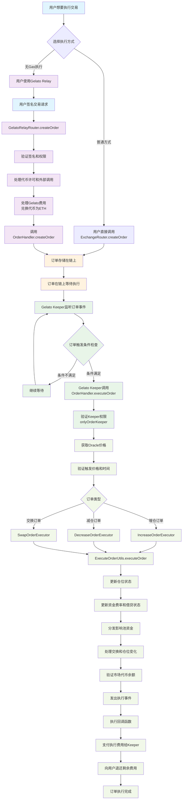

## Gelato Keeper的双重角色

### 1. **Gelato Relay帮助用户创建订单（createOrder）**
- 用户无需持有ETH支付Gas费用
- 通过GelatoRelayRouter签名和提交订单
- Gelato Relay代为支付创建订单的Gas费用
- 最终调用`OrderHandler.createOrder`将订单存储在链上

### 2. **Gelato Keeper执行订单（executeOrder）**
- 监听链上的订单事件
- 检查订单触发条件（价格、时间等）
- 当条件满足时，调用`OrderHandler.executeOrder`
- 具有`onlyOrderKeeper`权限
- 获得执行费用作为奖励

## Gelato Keeper的核心作用

### 1. **Meta Transaction / Gasless Transaction 支持**

**主要功能**：让用户能够在**不持有ETH支付gas费**的情况下进行交易

```24:27:contracts/router/relay/BaseGelatoRelayRouter.sol
/*
 * For gasless actions the funds are deducted from account.
 * Account must have enough funds to pay fees, regardless of the recipient's balance.
 */

**工作机制**：
- 用户签名交易但不直接发送到链上
- Gelato网络代替用户支付gas费
- 用户的交易费用从其账户余额中扣除（用代币支付而非ETH）

### 2. **两种费用支付模式**

根据代码注释，Gelato支持两种不同的费用支付方式：

```306:325:contracts/router/relay/BaseGelatoRelayRouter.sol
// callWithSyncFee:
// - GMX contracts pay relay fee to the Gelato Relay within the same transaction
// - the fee amount is calculated on Gelato Relay side, it depends on the gas used, gas price and conversion rate
// - UI should retrieve the fee amount from the Gelato API
//
// sponsoredCall:
// - GMX contracts do not pay Gelato Relay directly, instead Gelato 1Balance is used to cover the cost
// - GMX contracts charge users for the call and deposit funds to `RELAY_FEE_ADDRESS`;
//   these funds will later be used to top up Gelato 1Balance
```

**模式A - callWithSyncFee**：
- GMX直接向Gelato支付中继费用
- 费用由Gelato计算（基于实际gas使用、价格、汇率）

**模式B - sponsoredCall**：
- GMX不直接支付Gelato，而是使用Gelato 1Balance
- GMX向用户收费并存入`RELAY_FEE_ADDRESS`，后续用于充值1Balance

### 3. **支持的操作类型**

Gelato Relay Router支持批量操作：

```30:52:contracts/router/relay/GelatoRelayRouter.sol
function batch(
    IRelayUtils.RelayParams calldata relayParams,
    address account,
    IRelayUtils.BatchParams calldata params
)
    external
    nonReentrant
    withRelay(relayParams, account, 0, false) // srcChainId is the current block.chainId
    returns (bytes32[] memory)
```

**支持的具体操作**：
- **创建订单** (`createOrder`)
- **更新订单** (`updateOrder`)
- **取消订单** (`cancelOrder`)
- **批量操作** (`batch`) - 可以一次性执行多个操作

### 4. **子账户支持**

还有专门的`SubaccountGelatoRelayRouter`，支持子账户的gasless操作，这让用户可以：
- 通过子账户进行gasless交易
- 更灵活的权限管理和资金控制

### 5. **用户体验提升**

**核心价值**：
```39:51:contracts/router/relay/BaseGelatoRelayRouter.sol
modifier withRelay(
    IRelayUtils.RelayParams calldata relayParams,
    address account,
    uint256 srcChainId,
    bool isSubaccount
) {
    uint256 startingGas = gasleft();
    _validateGaslessFeature();
    // ... 处理中继逻辑
}
```

**用户体验优势**：
- **降低入门门槛**：新用户不需要先获得ETH就能开始交易
- **简化操作流程**：一笔交易可以完成多个操作（批量处理）
- **更好的流动性管理**：用户可以用任何支持的代币支付手续费
- **跨链友好**：支持多链操作而无需在每条链上都持有原生代币

## 总结

Gelato Keeper在GMX Synthetics中的作用是：

1. **Gas抽象化** - 让用户无需持有ETH即可交易
2. **Meta Transaction支持** - 用户签名，Gelato执行
3. **批量操作优化** - 一次交易完成多个操作
4. **费用灵活支付** - 用代币而非ETH支付gas费
5. **用户体验提升** - 降低DeFi使用门槛

这是GMX为了提升用户体验、降低使用门槛而集成的重要基础设施，特别适合那些刚进入DeFi生态或者不想管理多种原生代币的用户。
