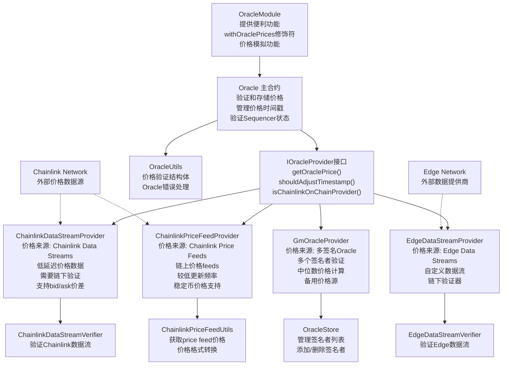
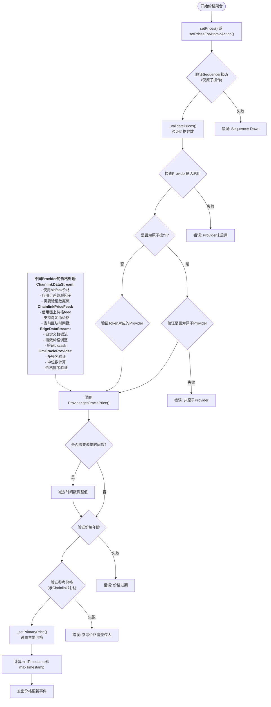
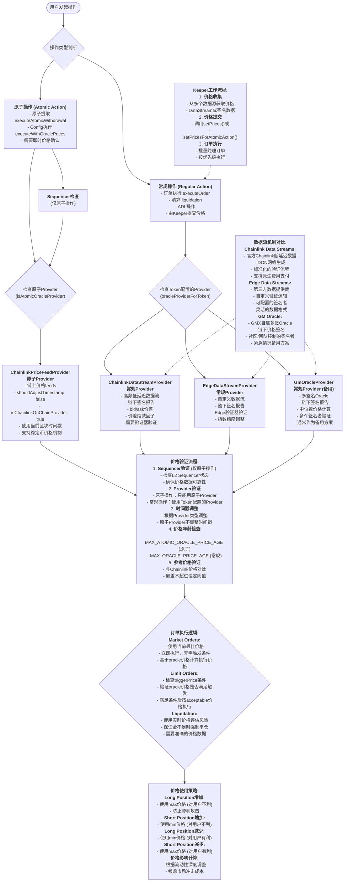

# Oracle合约层级
 

### 1. Oracle架构概述

GMX Synthetics的Oracle系统采用了模块化设计，包含以下关键组件：

**主要合约：**
- `Oracle.sol` - 核心Oracle合约，负责价格验证和存储
- `OracleStore.sol` - 管理签名者列表
- `OracleModule.sol` - 提供便利功能和修饰符

**四个价格来源：**
1. **ChainlinkDataStreamProvider** - Chainlink低延迟数据流
2. **ChainlinkPriceFeedProvider** - Chainlink链上价格feeds
3. **EdgeDataStreamProvider** - Edge自定义数据流
4. **GmOracleProvider** - 多签名Oracle（备用）

# 价格聚合机制

### 2. 价格聚合机制

价格聚合遵循以下流程：
1. **验证Sequencer状态**（仅原子操作）
2. **Provider验证** - 检查是否启用和配置正确
3. **获取价格** - 调用相应Provider的`getOraclePrice()`
4. **时间戳调整** - 根据Provider类型调整
5. **价格验证** - 年龄检查和参考价格对比
6. **存储价格** - 设置主要价格并发出事件

# 不同场景下的预言机选择
### 核心机制区别

**1. 原子操作 vs 常规操作**
- **原子操作** (`setPricesForAtomicAction`): 需要即时价格确认的操作，如原子提取、配置执行
- **常规操作** (`setPrices`): 由Keeper提交价格的操作，如订单执行、清算

**2. 不同OracleProvider的机制**

**ChainlinkPriceFeedProvider (原子Provider):**
- 链上价格feeds，实时获取
- `shouldAdjustTimestamp: false` - 不调整时间戳
- `isChainlinkOnChainProvider: true` - 是链上提供商
- 只能用于原子操作

**ChainlinkDataStreamProvider (常规Provider):**
- 高频低延迟的链下签名报告
- 通过验证器验证数据流
- 支持bid/ask价差和价差缩减
- 主要用于常规操作

**EdgeDataStreamProvider (常规Provider):**
- 自定义的链下签名报告
- 有独立的验证器
- 支持灵活的数据格式

**GmOracleProvider (常规Provider，备用):**
- GMX多签名Oracle
- 链下签名，多个签名者验证
- 中位数价格计算
- 通常作为备用方案

### 使用场景选择

**原子操作场景:**
- 必须使用标记为 `isAtomicOracleProvider: true` 的提供商
- 主要是 `ChainlinkPriceFeedProvider`
- 需要验证Sequencer状态
- 用于需要即时确认的操作

**常规操作场景:**
- 使用Token配置的Provider (`oracleProviderForTokenKey`)
- 默认通常是 `ChainlinkDataStreamProvider`
- 由Keeper提交链下签名的价格数据
- 用于订单执行、清算等操作

这个重新设计的图表准确反映了GMX Synthetics中不同Oracle提供商的实际使用机制和选择逻辑。数据流和GM Oracle都是链下签名报告，但在不同场景下有不同的使用优先级和验证机制。

