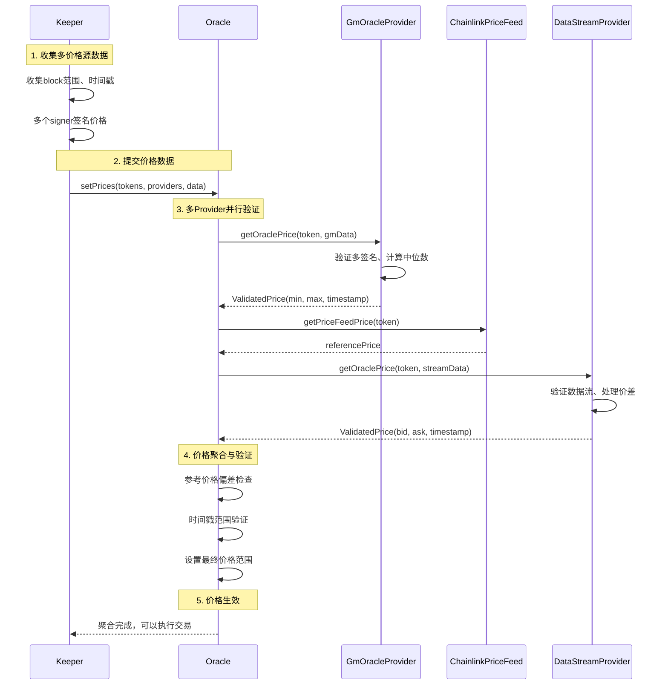

```mermaid
sequenceDiagram
    participant K as Keeper
    participant O as Oracle
    participant GM as GmOracleProvider  
    participant CL as ChainlinkPriceFeed
    participant DS as DataStreamProvider
    
    Note over K: 1. 收集多价格源数据
    K->>K: 收集block范围、时间戳
    K->>K: 多个signer签名价格
    
    Note over K,O: 2. 提交价格数据
    K->>O: setPrices(tokens, providers, data)
    
    Note over O: 3. 多Provider并行验证
    O->>GM: getOraclePrice(token, gmData)
    GM->>GM: 验证多签名、计算中位数
    GM-->>O: ValidatedPrice(min, max, timestamp)
    
    O->>CL: getPriceFeedPrice(token)
    CL-->>O: referencePrice
    
    O->>DS: getOraclePrice(token, streamData)  
    DS->>DS: 验证数据流、处理价差
    DS-->>O: ValidatedPrice(bid, ask, timestamp)
    
    Note over O: 4. 价格聚合与验证
    O->>O: 参考价格偏差检查
    O->>O: 时间戳范围验证
    O->>O: 设置最终价格范围
    
    Note over O: 5. 价格生效
    O-->>K: 聚合完成，可以执行交易
```

