# Oracle合约层级
 

### 1. Oracle架构概述

GMX Synthetics的Oracle系统采用了模块化设计，包含以下关键组件：

**主要合约：**
- `Oracle.sol` - 核心Oracle合约，负责价格验证和存储
- `OracleStore.sol` - 管理签名者列表
- `OracleModule.sol` - 提供便利功能和修饰符

**四个价格来源：**
1. **ChainlinkDataStreamProvider** - Chainlink低延迟数据流
2. **ChainlinkPriceFeedProvider** - Chainlink链上价格feeds
3. **EdgeDataStreamProvider** - Edge自定义数据流
4. **GmOracleProvider** - 多签名Oracle（备用）

# 价格聚合机制

### 2. 价格聚合机制

价格聚合遵循以下流程：
1. **验证Sequencer状态**（仅原子操作）
2. **Provider验证** - 检查是否启用和配置正确
3. **获取价格** - 调用相应Provider的`getOraclePrice()`
4. **时间戳调整** - 根据Provider类型调整
5. **价格验证** - 年龄检查和参考价格对比
6. **存储价格** - 设置主要价格并发出事件

# 不同场景下的预言机选择
### 核心机制区别

**1. 原子操作 vs 常规操作**
- **原子操作** (`setPricesForAtomicAction`): 
  - 需要即时价格确认的操作，如原子提取、配置执行
  - **必须验证L2排序器(Sequencer)状态** - 确保排序器处于正常运行状态
  - 如果排序器离线，使用链上价格可能获得过期数据，因此需要额外的安全检查
  - 只能使用原子Provider (ChainlinkPriceFeedProvider)
- **常规操作** (`setPrices`): 
  - 由Keeper提交链下签名价格数据的操作，如订单执行、清算
  - 不需要验证排序器状态，因为使用的是链下签名的实时价格数据

**2. 时间戳统一机制**
由于不同Provider的数据来源和延迟不同，需要通过时间戳调整来统一时间：
- **原子Provider** (`ChainlinkPriceFeedProvider`): 使用当前区块时间戳，不需要调整
- **常规Provider**: 使用链下数据，需要通过`shouldAdjustTimestamp() = true`启用时间戳调整
- **调整机制**: `validatedPrice.timestamp -= timestampAdjustment` 减去配置的调整值
- **目的**: 确保不同来源的价格数据在时间上保持同步，避免时间戳范围超限错误

**3. 不同OracleProvider的机制**

**ChainlinkPriceFeedProvider (原子Provider):**
- 链上价格feeds，实时获取
- `shouldAdjustTimestamp: false` - 不调整时间戳
- `isChainlinkOnChainProvider: true` - 是链上提供商
- 只能用于原子操作

**ChainlinkDataStreamProvider (常规Provider):**
- 高频低延迟的链下签名报告
- 通过验证器验证数据流
- 支持bid/ask价差和价差缩减
- `shouldAdjustTimestamp: true` - 需要时间戳调整
- 主要用于常规操作

**EdgeDataStreamProvider (常规Provider):**
- 自定义的链下签名报告
- 有独立的验证器
- 支持灵活的数据格式
- `shouldAdjustTimestamp: true` - 需要时间戳调整

**GmOracleProvider (常规Provider，备用):**
- **备用价格源** - 仅在其他Provider不可用时使用
- GMX自建多签名Oracle，不是原子Provider
- 链下签名，多个签名者验证，计算中位数价格
- `shouldAdjustTimestamp: true` - 需要时间戳调整以统一不同来源的时间
- 支持时间窗口机制 (minOracleBlockNumber到maxOracleBlockNumber)

### 使用场景选择

**原子操作场景:**
- 必须使用标记为 `isAtomicOracleProvider: true` 的提供商
- 主要是 `ChainlinkPriceFeedProvider`
- **必须验证L2排序器状态** - 防止在排序器离线时使用过期价格
- **LP优先保护设计**:
  - **原子提取** (`executeAtomicWithdrawal`): LP可以直接提取流动性，无需Keeper
  - **即时执行**: 用户无需等待，立即获得流动性控制权
  - **条件限制**: 仅当所有底层市场都配置Chainlink feeds时可用
  - **设计理念**: LP是协议基础，应享有更高的操作优先级和安全保护

**常规操作场景:**
- 使用Token配置的Provider (`oracleProviderForTokenKey`)
- 默认通常是 `ChainlinkDataStreamProvider`
- 由Keeper提交链下签名的价格数据
- **Trader功能丰富**: 支持复杂订单、杠杆、swap路径等
- **延迟可接受**: 通过Keeper执行，换取更复杂的功能和更低的gas成本
- 用于订单执行、清算等操作

这个重新设计的图表准确反映了GMX Synthetics中不同Oracle提供商的实际使用机制和选择逻辑。数据流和GM Oracle都是链下签名报告，但在不同场景下有不同的使用优先级和验证机制。

```mermaid
graph TD
    Start([用户发起操作])
    
    ActionType{"操作类型判断"}
    
    AtomicAction["`**原子操作 (Atomic Action)**
    - **原子提取** executeAtomicWithdrawal
      · LP可以直接执行，无需等待Keeper
      · 即时流动性提取，优先保护LP利益
      · 仅限所有底层市场都有Chainlink feeds的情况
    - **Config执行** executeWithOraclePrices
      · 协议配置更新时的价格确认
    - **核心特点**: 即时确认、无中介、LP优先`"]
    
    RegularAction["`**常规操作 (Regular Action)**
    - 订单执行 executeOrder
    - 清算 liquidation 
    - ADL操作
    - 由Keeper提交价格`"]
    
    AtomicProviderCheck{"检查原子Provider<br/>(isAtomicOracleProvider)"}
    
    TokenProviderCheck{"检查Token配置的Provider<br/>(oracleProviderForToken)"}
    
    ChainlinkPriceFeed["`**ChainlinkPriceFeedProvider**
    **原子Provider**
    - 链上价格feeds
    - shouldAdjustTimestamp: false
    - isChainlinkOnChainProvider: true
    - 使用当前区块时间戳
    - 支持稳定币价格机制`"]
    
    ChainlinkDataStream["`**ChainlinkDataStreamProvider**
    **常规Provider**
    - 高频低延迟数据流
    - 链下签名报告
    - bid/ask价差
    - 价差缩减因子
    - 需要验证器验证`"]
    
    EdgeDataStream["`**EdgeDataStreamProvider**
    **常规Provider**
    - 自定义数据流
    - 链下签名报告
    - Edge验证器验证
    - 指数精度调整`"]
    
    GmOracle["`**GmOracleProvider**
    **常规Provider (备用)**
    - GMX自建多签名Oracle
    - 备用价格源，非原子Provider
    - 链下签名报告，中位数价格计算
    - 时间窗口机制支持并发
    - 需要时间戳调整统一时间`"]
    
    OrderExecution{"`**订单执行逻辑:**
    **Market Orders:**
    - 使用当前最佳价格
    - 立即执行，无需触发条件
    - 基于oracle价格计算执行价格
    **Limit Orders:**
    - 检查triggerPrice条件
    - 验证oracle价格是否满足触发
    - 满足条件后按acceptable价格执行
    **Liquidation:**
    - 使用实时价格评估风险
    - 保证金不足时强制平仓
    - 需要准确的价格数据`"}
    
    PriceValidation["`**价格验证流程:**
    1. **Sequencer验证** (仅原子操作)
       - 检查L2 Sequencer状态
       - 防止排序器离线时使用过期价格
       - 确保原子操作的安全性
    2. **Provider验证**
       - 原子操作：只能用原子Provider
       - 常规操作：使用Token配置的Provider
    3. **时间戳调整统一**
       - 原子Provider：不调整，使用区块时间戳
       - 常规Provider：调整以统一不同来源时间
       - 避免时间戳范围超限错误
    4. **价格年龄检查**
       - MAX_ATOMIC_ORACLE_PRICE_AGE (原子)
       - MAX_ORACLE_PRICE_AGE (常规)
    5. **参考价格验证**
       - 与Chainlink价格对比
       - 偏差不超过设定阈值`"]
    
    DataStreamMechanism["`**数据流机制对比:**
    **Chainlink Data Streams:**
    - 官方Chainlink低延迟数据
    - DON网络生成
    - 标准化的验证流程
    - 支持原生费用支付
    **Edge Data Streams:**
    - 第三方数据提供商
    - 自定义验证逻辑
    - 可配置的签名者
    - 灵活的数据格式
    **GM Oracle:**
    - GMX自建多签Oracle (备用价格源)
    - 链下价格签名，非原子Provider
    - 中位数价格计算，时间窗口并发支持
    - 需要时间戳调整统一不同来源时间
    - 仅在其他Provider不可用时使用`"]
    
    PriceUsage["`**价格使用策略:**
    **Long Position增加:**
    - 使用max价格 (对用户不利)
    - 防止套利攻击
    **Short Position增加:**
    - 使用min价格 (对用户不利)
    **Long Position减少:**
    - 使用min价格 (对用户有利)
    **Short Position减少:**
    - 使用max价格 (对用户有利)
    **价格影响计算:**
    - 根据流动性深度调整
    - 考虑市场冲击成本`"]
    
    Start --> ActionType
    
    ActionType --> AtomicAction
    ActionType --> RegularAction
    
    AtomicAction --> AtomicProviderCheck
    RegularAction --> TokenProviderCheck
    
    AtomicProviderCheck --> ChainlinkPriceFeed
    
    TokenProviderCheck --> ChainlinkDataStream
    TokenProviderCheck --> EdgeDataStream
    TokenProviderCheck --> GmOracle
    
    ChainlinkPriceFeed --> PriceValidation
    ChainlinkDataStream --> PriceValidation
    EdgeDataStream --> PriceValidation
    GmOracle --> PriceValidation
    
    PriceValidation --> OrderExecution
    OrderExecution --> PriceUsage
    
    DataStreamMechanism -.-> ChainlinkDataStream
    DataStreamMechanism -.-> EdgeDataStream
    DataStreamMechanism -.-> GmOracle
    
    SequencerCheck["`**L2排序器状态检查**
    (仅原子操作)
    - 验证排序器是否正常运行
    - 防止排序器离线时使用过期价格
    - 确保原子操作的安全性`"]
    
    AtomicAction --> SequencerCheck
    SequencerCheck --> AtomicProviderCheck
    
    KeeperFlow["`**Keeper工作流程:**
    1. **价格收集**
       - 从多个数据源获取价格
       - DataStream或签名数据
    2. **价格提交**
       - 调用setPrices()或
       - setPricesForAtomicAction()
    3. **订单执行**
       - 批量处理订单
       - 按优先级执行`"]

    
    KeeperFlow -.-> RegularAction
```

