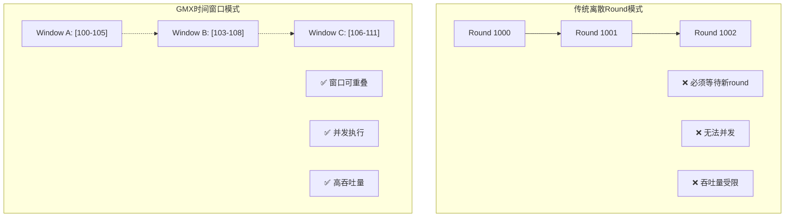
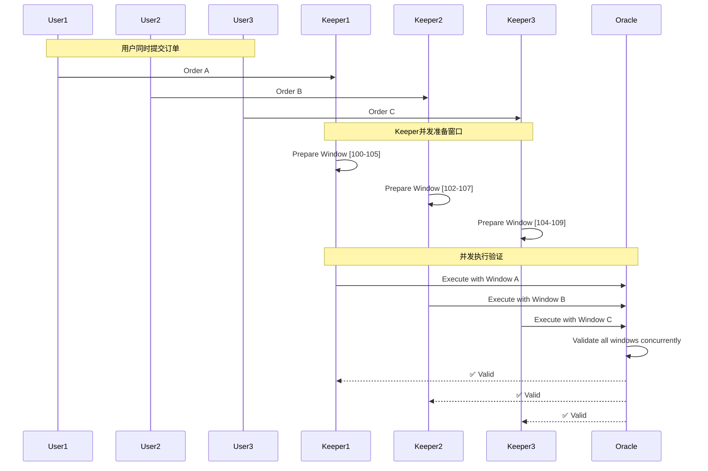

## 🎯 GmOracleProvider时间窗口机制的高频交易并发优势深度分析

### 🔐 **核心时间窗口验证机制**

```143:149:contracts/oracle/GmOracleProvider.sol
if (report.minOracleBlockNumber > report.maxOracleBlockNumber) {
    revert Errors.GmInvalidMinMaxBlockNumber(report.minOracleBlockNumber, report.maxOracleBlockNumber);
}

if (report.maxOracleBlockNumber >= Chain.currentBlockNumber()) {
    revert Errors.GmInvalidBlockNumber(report.maxOracleBlockNumber, Chain.currentBlockNumber());
}
```

### 🚀 **时间窗口机制的五大并发优势**

#### **1. 窗口重叠 → 并发执行**



**具体实现：**
```typescript
// 时间轴: Block 100 -> 101 -> 102 -> 103 -> 104 -> 105 -> 106 -> 107

// Keeper A 使用窗口 [100, 105]
const windowA = {
    minOracleBlockNumber: 100,
    maxOracleBlockNumber: 105,
    validPeriod: "6 blocks"
}

// Keeper B 同时使用窗口 [103, 108] 
const windowB = {
    minOracleBlockNumber: 103,
    maxOracleBlockNumber: 108,
    validPeriod: "6 blocks"
}

// 重叠区间 [103, 105] - 两个keeper可以并发执行！
```

#### **2. 灵活窗口大小 → 适应不同延迟需求**

```15:16:contracts/oracle/GmOracleUtils.sol
uint256 minOracleBlockNumber;  // 🔑 窗口起始
uint256 maxOracleBlockNumber;  // 🔑 窗口结束
```

**优势场景：**
```solidity
// 高频交易：小窗口，低延迟
struct HighFreqWindow {
    minOracleBlockNumber: currentBlock - 2;
    maxOracleBlockNumber: currentBlock - 1;
    // 窗口大小：2 blocks ≈ 24秒 (Arbitrum)
}

// 大额交易：大窗口，更多确认
struct LargeTradeWindow {
    minOracleBlockNumber: currentBlock - 10;
    maxOracleBlockNumber: currentBlock - 5;
    // 窗口大小：6 blocks ≈ 72秒
}

// 两种交易可以同时执行，使用不同的价格确认度
```

#### **3. 多Keeper并发处理**

**场景A：负载分散**


#### **4. 抗网络延迟 → 弹性时间容忍**

```147:149:contracts/oracle/GmOracleProvider.sol
if (report.maxOracleBlockNumber >= Chain.currentBlockNumber()) {
    revert Errors.GmInvalidBlockNumber(report.maxOracleBlockNumber, Chain.currentBlockNumber());
}
```

**网络延迟适应性：**
```typescript
// Keeper在不同网络条件下的策略

// 低延迟网络：激进窗口
const aggressiveWindow = {
    minOracleBlockNumber: currentBlock - 1,
    maxOracleBlockNumber: currentBlock - 1,
    latencyTolerance: "minimal"
}

// 高延迟网络：保守窗口  
const conservativeWindow = {
    minOracleBlockNumber: currentBlock - 5,
    maxOracleBlockNumber: currentBlock - 2,
    latencyTolerance: "high",
    fallbackRange: "3 blocks"
}

// 两种策略可以同时存在，适应不同keeper的网络条件
```
 
