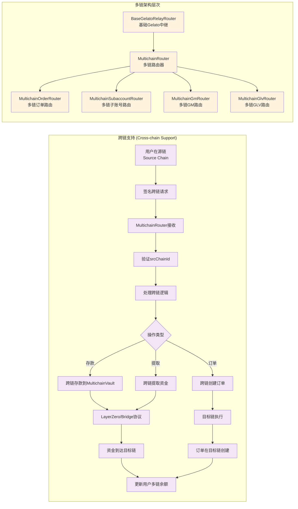

# GMX Synthetics 跨链流程和架构详解 - 以MultichainOrderRouter为例

```mermaid
flowchart LR
    subgraph "跨链架构概览 (Cross-chain Architecture)"
        A[用户在源链] --> B[签名跨链请求]
        B --> C[MultichainOrderRouter]
        C --> D[LayerZero/Stargate桥接]
        D --> E[目标链执行]
        E --> F[MultichainVault资金管理]
    end
    
    subgraph "MultichainOrderRouter核心流程"
        G[MultichainOrderRouter] --> H{操作类型}
        
        H --> I[批量操作<br/>batch]
        H --> J[创建订单<br/>createOrder]
        H --> K[更新订单<br/>updateOrder]
        H --> L[取消订单<br/>cancelOrder]
        H --> M[设置推荐码<br/>setTraderReferralCode]
        
        I --> N[withRelay修饰器验证]
        J --> N
        K --> N
        L --> N
        M --> N
        
        N --> O[跨链参数验证]
        O --> P[EIP-712签名验证]
        P --> Q[执行具体操作]
    end
    
    subgraph "withRelay跨链验证逻辑"
        R[withRelay开始] --> S[记录startingGas]
        S --> T[验证无Gas功能]
        T --> U[获取合约实例]
        U --> V[_isMultichain返回true]
        
        V --> W[跨链验证分支]
        W --> X[验证desChainId等于当前链ID]
        X --> Y[验证不允许tokenPermits]
        Y --> Z[验证srcChainId已启用]
        
        Z --> AA[处理中继前操作]
        AA --> BB[执行主要业务逻辑]
        BB --> CC[处理中继后操作]
    end
    
    subgraph "多链余额管理系统"
        DD[MultichainVault] --> EE[StrictBank基础]
        EE --> FF[代币余额记录]
        
        FF --> GG[增加余额<br/>recordTransferIn]
        FF --> HH[减少余额<br/>transferOut]
        FF --> II[查询余额<br/>getMultichainBalanceAmount]
        
        GG --> JJ[dataStore递增余额]
        HH --> KK[dataStore递减余额]
        II --> LL[dataStore查询余额]
        
        JJ --> MM[发出TransferIn事件]
        KK --> NN[发出TransferOut事件]
    end
    
    subgraph "LayerZero桥接集成"
        OO[LayerZeroProvider] --> PP[接收跨链资金<br/>lzCompose]
        OO --> QQ[发送跨链资金<br/>bridgeOut]
        
        PP --> RR[验证Provider和Endpoint]
        PP --> SS[解码LayerZero消息]
        PP --> TT[记录资金到达<br/>recordBridgeIn]
        PP --> UU[执行后续操作]
        
        QQ --> VV[准备Stargate参数]
        QQ --> WW[计算桥接费用]
        QQ --> XX[从用户多链余额扣费]
        QQ --> YY[调用Stargate桥接]
        
        TT --> ZZ[增加用户多链余额]
        UU --> AAA[可选：自动执行存款/订单]
    end
    
    subgraph "资金流向详解"
        BBB[用户源链资金] --> CCC[LayerZero桥接]
        CCC --> DDD[目标链LayerZeroProvider]
        DDD --> EEE[MultichainVault]
        EEE --> FFF[用户多链余额]
        
        FFF --> GGG{操作类型}
        GGG --> HHH[创建订单：转移到OrderVault]
        GGG --> III[取出资金：桥接回源链]
        GGG --> JJJ[存款操作：转移到相应Vault]
        
        HHH --> KKK[OrderHandler处理]
        III --> LLL[LayerZero桥接回源链]
        JJJ --> MMM[DepositHandler处理]
    end
    
    subgraph "跨链签名和验证"
        NNN[用户签名] --> OOO[EIP-712结构化数据]
        OOO --> PPP[包含srcChainId的域分隔符]
        PPP --> QQQ[结构体哈希计算]
        
        QQQ --> RRR[createOrder结构体]
        QQQ --> SSS[updateOrder结构体]
        QQQ --> TTT[cancelOrder结构体]
        QQQ --> UUU[batch结构体]
        
        RRR --> VVV[签名验证]
        SSS --> VVV
        TTT --> VVV
        UUU --> VVV
        
        VVV --> WWW[防重放攻击检查]
        WWW --> XXX[执行权限确认]
    end
    
    subgraph "多链路由器家族"
        YYY[BaseGelatoRelayRouter] --> ZZZ[MultichainRouter抽象类]
        
        ZZZ --> AAAA[MultichainOrderRouter<br/>订单管理]
        ZZZ --> BBBB[MultichainGmRouter<br/>GM代币操作]
        ZZZ --> CCCC[MultichainGlvRouter<br/>GLV代币操作]
        ZZZ --> DDDD[MultichainSubaccountRouter<br/>子账号跨链]
        ZZZ --> EEEE[MultichainTransferRouter<br/>资金桥接]
        ZZZ --> FFFF[MultichainClaimsRouter<br/>奖励领取]
    end
    
    %% 样式设置
    classDef overview fill:#e3f2fd
    classDef orderRouter fill:#f3e5f5
    classDef relay fill:#e8f5e8
    classDef vault fill:#fff3e0
    classDef layerzero fill:#fce4ec
    classDef flow fill:#f1f8e9
    classDef signature fill:#e0f2f1
    classDef family fill:#fef7e0
    
    class A,B,C,D,E,F overview
    class G,H,I,J,K,L,M,N,O,P,Q orderRouter
    class R,S,T,U,V,W,X,Y,Z,AA,BB,CC relay
    class DD,EE,FF,GG,HH,II,JJ,KK,LL,MM,NN vault
    class OO,PP,QQ,RR,SS,TT,UU,VV,WW,XX,YY,ZZ,AAA layerzero
    class BBB,CCC,DDD,EEE,FFF,GGG,HHH,III,JJJ,KKK,LLL,MMM flow
    class NNN,OOO,PPP,QQQ,RRR,SSS,TTT,UUU,VVV,WWW,XXX signature
    class YYY,ZZZ,AAAA,BBBB,CCCC,DDDD,EEEE,FFFF family
```


 





 
## 1. **跨链架构概览**

### 核心组件
- **MultichainOrderRouter**: 跨链订单路由器
- **MultichainVault**: 多链资金金库
- **LayerZeroProvider**: LayerZero桥接提供者
- **MultichainUtils**: 多链工具库

### 设计理念
用户可以在任意支持的链上发起请求，通过LayerZero协议将操作传递到目标链（通常是主链），在目标链上执行具体的DeFi操作。

## 2. **MultichainOrderRouter详细分析**

### 2.1 基础架构
```solidity
contract MultichainOrderRouter is IMultichainOrderRouter, MultichainRouter {
    IReferralStorage public immutable referralStorage;
    
    constructor(
        BaseConstructorParams memory params,
        IReferralStorage _referralStorage
    ) MultichainRouter(params) 
      BaseRouter(params.router, params.roleStore, params.dataStore, params.eventEmitter) {
        referralStorage = _referralStorage;
    }
}
```

**继承链**：
- `MultichainOrderRouter` → `MultichainRouter` → `BaseGelatoRelayRouter` → `BaseRouter`

### 2.2 支持的跨链操作

#### 批量操作
```solidity
function batch(
    IRelayUtils.RelayParams calldata relayParams,
    address account,
    uint256 srcChainId,  // 源链ID
    IRelayUtils.BatchParams calldata params
) external nonReentrant withRelay(relayParams, account, srcChainId, false)
```

#### 订单操作
- **createOrder**: 跨链创建订单
- **updateOrder**: 跨链更新订单  
- **cancelOrder**: 跨链取消订单
- **setTraderReferralCode**: 跨链设置推荐码

## 3. **withRelay跨链验证机制**

### 3.1 多链验证逻辑
```solidity
function _validateCallWithoutSignature(
    uint256 srcChainId, 
    uint256 desChainId, 
    uint256 deadline, 
    uint256 tokenPermitsLength
) internal view {
    // 1. 验证目标链ID
    if (desChainId != block.chainid) {
        revert Errors.InvalidDestinationChainId(desChainId);
    }
    
    if (_isMultichain()) {
        // 2. 多链模式不允许代币许可
        if (tokenPermitsLength != 0) {
            revert Errors.TokenPermitsNotAllowedForMultichain();
        }
        // 3. 验证源链ID已启用
        if (!dataStore.getBool(Keys.isSrcChainIdEnabledKey(srcChainId))) {
            revert Errors.InvalidSrcChainId(srcChainId);
        }
    }
    
    // 4. 验证截止时间
    _validateDeadline(deadline);
}
```

### 3.2 关键区别
**多链模式 vs 无Gas模式**：
- **多链模式** (`_isMultichain() = true`): 允许 `srcChainId != block.chainid`
- **无Gas模式** (`_isMultichain() = false`): 要求 `srcChainId == block.chainid`

## 4. **MultichainVault余额管理系统**

### 4.1 核心功能
```solidity
contract MultichainVault is StrictBank {
    // 继承StrictBank的所有功能
}
```

### 4.2 余额操作
```solidity
// 增加用户多链余额
function recordTransferIn(
    DataStore dataStore,
    EventEmitter eventEmitter,
    MultichainVault multichainVault,
    address token,
    address account,
    uint256 srcChainId
) external returns (uint256) {
    uint256 amount = multichainVault.recordTransferIn(token);
    _increaseMultichainBalance(dataStore, eventEmitter, account, token, amount, srcChainId);
    return amount;
}

// 减少用户多链余额
function transferOut(
    DataStore dataStore,
    EventEmitter eventEmitter,
    MultichainVault multichainVault,
    address token,
    address account,
    address receiver,
    uint256 amount,
    uint256 srcChainId
) external {
    uint256 balance = getMultichainBalanceAmount(dataStore, account, token);
    if (balance < amount) {
        revert Errors.InsufficientMultichainBalance(account, token, balance, amount);
    }
    
    dataStore.decrementUint(Keys.multichainBalanceKey(account, token), amount);
    multichainVault.transferOut(token, receiver, amount);
}
```

### 4.3 余额查询
```solidity
function getMultichainBalanceAmount(
    DataStore dataStore,
    address account,
    address token
) public view returns (uint256) {
    return dataStore.getUint(Keys.multichainBalanceKey(account, token));
}
```

## 5. **LayerZero桥接集成**

### 5.1 接收跨链资金 (Bridge In)
```solidity
function lzCompose(
    address from,
    bytes32 /*guid*/,
    bytes calldata message,
    address /*executor*/,
    bytes calldata /*extraData*/
) external payable {
    // 1. 验证Provider和Endpoint
    MultichainUtils.validateMultichainProvider(dataStore, from);
    MultichainUtils.validateMultichainEndpoint(dataStore, msg.sender);
    
    // 2. 解码LayerZero消息
    (address account, uint256 srcChainId, uint256 amountLD, bytes memory data) = 
        _decodeLzComposeMsg(message);
    
    // 3. 处理代币转移
    address token = IStargate(from).token();
    if (token == address(0x0)) {
        // 原生代币：存入并包装
        TokenUtils.depositAndSendWrappedNativeToken(dataStore, address(multichainVault), amountLD);
        token = TokenUtils.wnt(dataStore);
    } else {
        // ERC20代币：直接转移
        TokenUtils.transfer(dataStore, token, address(multichainVault), amountLD);
    }
    
    // 4. 记录用户多链余额
    MultichainUtils.recordBridgeIn(
        dataStore, eventEmitter, multichainVault, this, token, account, srcChainId
    );
    
    // 5. 可选：执行后续操作（存款、订单等）
    if (srcChainId != 0 && data.length != 0) {
        _executeFollowUpAction(account, srcChainId, data);
    }
}
```

### 5.2 发送跨链资金 (Bridge Out)
```solidity
function bridgeOut(
    address account, 
    uint256 srcChainId, 
    IRelayUtils.BridgeOutParams memory params
) external onlyController returns (uint256) {
    // 1. 验证代币类型
    IStargate stargate = IStargate(params.provider);
    if (stargate.token() == address(0x0)) {
        require(params.token == wnt, "Invalid token for native pool");
    } else {
        require(params.token == stargate.token(), "Invalid token for pool");
    }
    
    // 2. 准备Stargate参数
    (uint256 valueToSend, SendParam memory sendParam, MessagingFee memory messagingFee, OFTReceipt memory receipt) = 
        prepareSend(stargate, params.amount, params.minAmountOut, account, dstEid);
    
    // 3. 从用户多链余额扣除费用
    MultichainUtils.transferOut(
        dataStore, eventEmitter, multichainVault, wnt, account, address(this), valueToSend, srcChainId
    );
    
    // 4. 调用Stargate执行桥接
    stargate.sendToken{value: valueToSend}(sendParam, messagingFee, payable(address(this)));
    
    return receipt.amountSentLD;
}
```

## 6. **跨链资金流向**

### 6.1 资金流入
```
用户源链资金 → LayerZero桥接 → 目标链LayerZeroProvider → MultichainVault → 用户多链余额
```

### 6.2 资金使用
```
用户多链余额 → {
    创建订单: 转移到OrderVault
    存款操作: 转移到相应Vault
    取出资金: 桥接回源链
}
```

## 7. **跨链签名验证**

### 7.1 EIP-712结构化签名
```solidity
// 域分隔符包含源链ID
function getDomainSeparator(uint256 sourceChainId) external view returns (bytes32) {
    return keccak256(abi.encode(
        DOMAIN_SEPARATOR_TYPEHASH,
        DOMAIN_SEPARATOR_NAME_HASH,
        DOMAIN_SEPARATOR_VERSION_HASH,
        sourceChainId,  // 关键：使用源链ID而非当前链ID
        address(this)
    ));
}
```

### 7.2 结构体哈希
不同操作有不同的结构体哈希：
- `CREATE_ORDER_TYPEHASH`
- `UPDATE_ORDER_TYPEHASH`
- `CANCEL_ORDER_TYPEHASH`
- `BATCH_TYPEHASH`

## 8. **多链路由器生态**

### 8.1 路由器家族
```
BaseGelatoRelayRouter (基础)
    ↓
MultichainRouter (抽象多链基类)
    ↓
├── MultichainOrderRouter (订单管理)
├── MultichainGmRouter (GM代币操作)
├── MultichainGlvRouter (GLV代币操作)
├── MultichainSubaccountRouter (子账号跨链)
├── MultichainTransferRouter (资金桥接)
└── MultichainClaimsRouter (奖励领取)
```

### 8.2 统一的跨链基础设施
所有多链路由器共享：
- **MultichainVault**: 统一的资金管理
- **LayerZero集成**: 统一的桥接协议
- **EIP-712签名**: 统一的验证机制
- **事件系统**: 统一的监控机制

## 9. **安全机制**

### 9.1 多重验证
- **链ID验证**: 确保源链和目标链正确
- **签名验证**: EIP-712防篡改
- **权限验证**: Provider和Endpoint白名单
- **余额验证**: 确保用户有足够的多链余额

### 9.2 防重放攻击
- **摘要记录**: 每个交易摘要只能使用一次
- **时间限制**: 签名有效期限制
- **Nonce机制**: 在某些场景下使用递增nonce

## 10. **优势和特点**

### 10.1 用户体验
- **统一接口**: 在任意链上都能访问GMX功能
- **无Gas体验**: 用户无需在目标链持有Gas代币
- **自动化**: 支持跨链存款后自动执行操作

### 10.2 技术优势
- **模块化设计**: 不同功能分离，易于维护
- **安全性**: 多层验证机制
- **可扩展性**: 易于添加新的链和功能
- **事件驱动**: 完整的事件系统便于监控

 
