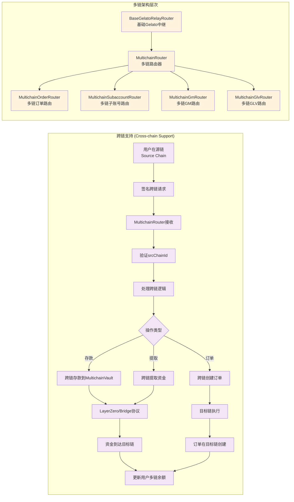

## 2. 跨链支持 (Cross-chain Support)



### 设计架构

**withRelay修饰器的跨链逻辑**：
```solidity
modifier withRelay(
    IRelayUtils.RelayParams calldata relayParams,
    address account,
    uint256 srcChainId,  // 关键：源链ID
    bool isSubaccount
) {
    // 1. 验证跨链参数
    if (_isMultichain()) {
        if (!dataStore.getBool(Keys.isSrcChainIdEnabledKey(srcChainId))) {
            revert Errors.InvalidSrcChainId(srcChainId);
        }
    }
    // 2. 执行跨链逻辑
    _;
}
```

### 跨链流程

**1. 同链操作 (srcChainId == block.chainid)**:
- 直接在当前链执行
- 使用标准的Gelato Relay

**2. 跨链操作 (srcChainId != block.chainid)**:
- 用户在源链签名请求
- 通过LayerZero等跨链协议传输
- 在目标链执行操作
- 资金在MultichainVault中管理

### 多链架构层次

**继承关系**：
```
BaseGelatoRelayRouter
    ↓
MultichainRouter (添加跨链支持)
    ↓
具体多链路由器:
- MultichainOrderRouter (订单)
- MultichainSubaccountRouter (子账号)
- MultichainGmRouter (GM代币)
- MultichainGlvRouter (GLV代币)
```

### 资金管理

**MultichainVault**：
- 管理用户在不同链上的余额
- 支持跨链资金转移
- 记录跨链交易历史

**LayerZero集成**：
- 使用LayerZero协议进行跨链通信
- 支持Stargate进行资金桥接
- 处理跨链费用和滑点
 
