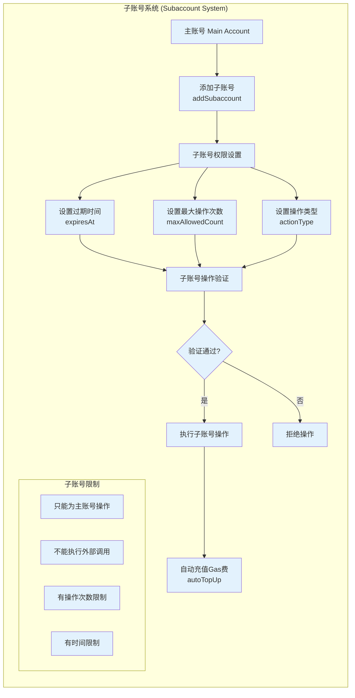

## 1. 子账号系统 (Subaccount System)


# GMX Synthetics 子账号 (Subaccount) 系统功能梳理

基于我对代码的深入分析，以下是GMX Synthetics中子账号系统的完整功能梳理：

## 1. **核心概念和架构**

### 子账号关系模型
- **主账号 (Main Account)**: 资金和权限的实际所有者
- **子账号 (Subaccount)**: 被授权代表主账号执行特定操作的地址
- **一对多关系**: 一个主账号可以有多个子账号
- **权限委托**: 子账号只能在授权范围内代表主账号操作

## 2. **子账号管理功能**

### 2.1 基础管理操作
```solidity
// 添加子账号
function addSubaccount(address subaccount) external payable nonReentrant

// 移除子账号  
function removeSubaccount(address subaccount) external payable nonReentrant

// 设置子账号权限过期时间
function setSubaccountExpiresAt(
    address subaccount,
    bytes32 actionType,
    uint256 expiresAt
) external payable nonReentrant

// 设置子账号最大操作次数
function setMaxAllowedSubaccountActionCount(
    address subaccount,
    bytes32 actionType,
    uint256 maxAllowedCount
) external payable nonReentrant

// 设置自动充值金额
function setSubaccountAutoTopUpAmount(
    address subaccount,
    uint256 amount
) external payable nonReentrant

// 设置集成标识符
function setIntegrationId(
    address subaccount,
    bytes32 integrationId
) external payable nonReentrant
```

### 2.2 权限控制参数
- **actionType**: 操作类型（如：`SUBACCOUNT_ORDER_ACTION`）
- **expiresAt**: 权限过期时间戳
- **maxAllowedCount**: 最大允许操作次数
- **integrationId**: 第三方集成标识符，用于管理不同dApp的权限

## 3. **支持的操作类型**

### 3.1 订单操作
子账号可以代表主账号执行以下订单操作：

```solidity
// 创建订单
function createOrder(
    address account,
    IBaseOrderUtils.CreateOrderParams calldata params
) external payable nonReentrant returns (bytes32)

// 更新订单
function updateOrder(
    bytes32 key,
    uint256 sizeDeltaUsd,
    uint256 acceptablePrice,
    uint256 triggerPrice,
    uint256 minOutputAmount,
    uint256 validFromTime,
    bool autoCancel
) external payable nonReentrant

// 取消订单
function cancelOrder(bytes32 key) external payable nonReentrant
```

### 3.2 操作限制
子账号操作受到严格限制：
- **receiver限制**: 订单的receiver必须是主账号
- **cancellationReceiver限制**: 如果设置，必须是主账号
- **资金控制**: 所有资金操作都在主账号名下进行

## 4. **安全验证机制**

### 4.1 多层验证流程
```solidity
function _handleSubaccountAction(address account, bytes32 actionType) internal {
    // 1. 功能启用检查
    FeatureUtils.validateFeature(dataStore, Keys.subaccountFeatureDisabledKey(address(this)));
    
    // 2. 集成ID验证  
    SubaccountUtils.validateIntegrationId(dataStore, account, subaccount);
    
    // 3. 子账号授权验证和操作计数
    SubaccountUtils.handleSubaccountAction(
        dataStore,
        eventEmitter,
        account,
        subaccount,
        actionType,
        1
    );
}
```

### 4.2 具体验证项目
- **子账号授权验证**: 检查子账号是否在主账号的授权列表中
- **集成ID验证**: 检查集成是否被禁用
- **操作次数验证**: 检查是否超出最大允许次数
- **时间验证**: 检查权限是否过期
- **功能开关**: 支持全局禁用子账号功能

## 5. **自动充值机制**

### 5.1 工作原理
```solidity
function _autoTopUpSubaccount(
    address account, 
    address subaccount, 
    uint256 startingGas, 
    uint256 executionFee
) internal {
    uint256 amount = SubaccountUtils.getSubaccountAutoTopUpAmount(dataStore, account, subaccount);
    
    // 计算实际Gas消费
    uint256 nativeTokensUsed = (startingGas - gasleft()) * tx.gasprice + executionFee;
    
    // 限制充值金额不超过实际消费
    if (nativeTokensUsed < amount) { 
        amount = nativeTokensUsed; 
    }
    
    // 从主账号转移WNT到子账号
    router.pluginTransfer(address(wnt), account, address(this), amount);
    TokenUtils.withdrawAndSendNativeToken(dataStore, address(wnt), subaccount, amount);
}
```

### 5.2 安全特性
- **精确计算**: 基于实际Gas消费和执行费用
- **上限控制**: 充值金额不超过实际使用量
- **余额检查**: 验证主账号有足够余额和授权
- **事件记录**: 完整的充值事件日志

## 6. **Gelato中继集成**

### 6.1 无Gas操作支持
通过`SubaccountGelatoRelayRouter`，子账号可以实现：
- **无Gas创建订单**: 用户无需持有ETH支付Gas
- **批量操作**: 一次交易执行多个订单操作
- **跨链支持**: 支持多链环境下的子账号操作

### 6.2 SubaccountApproval验证
```solidity
struct SubaccountApproval {
    address subaccount;      // 子账号地址
    bool shouldAdd;         // 是否添加子账号
    uint256 expiresAt;      // 权限过期时间
    uint256 maxAllowedCount; // 最大操作次数
    bytes32 actionType;     // 操作类型
    uint256 nonce;          // 防重放nonce
    uint256 desChainId;     // 目标链ID
    uint256 deadline;       // 签名截止时间
    bytes32 integrationId;  // 集成标识
    bytes signature;        // EIP-712签名
}
```

## 7. **多链支持**

### 7.1 跨链子账号操作
通过`MultichainSubaccountRouter`支持：
- **跨链订单管理**: 在不同链上管理订单
- **统一权限管理**: 跨链的权限验证
- **资金桥接**: 支持跨链资金操作

## 8. **事件系统**

### 8.1 完整的事件记录
- `AddSubaccount`: 添加子账号事件
- `RemoveSubaccount`: 移除子账号事件
- `SetSubaccountExpiresAt`: 设置过期时间事件
- `SetMaxAllowedSubaccountActionCount`: 设置操作次数限制事件
- `SetSubaccountAutoTopUpAmount`: 设置自动充值金额事件
- `SubaccountAutoTopUp`: 自动充值执行事件
- `IncrementSubaccountActionCount`: 操作计数递增事件

## 9. **应用场景**

### 9.1 典型用例
- **交易机器人**: 自动化交易策略执行
- **DeFi聚合器**: 集成GMX到其他DeFi协议
- **资产管理**: 专业交易者管理客户资金
- **API服务**: 提供程序化交易接口
- **移动应用**: 简化移动端交易体验

### 9.2 安全保障
- **权限最小化**: 只授予必要的操作权限
- **时间控制**: 权限自动过期机制
- **操作限制**: 次数和金额双重限制
- **实时监控**: 完整的操作日志
- **紧急停止**: 支持快速撤销权限

## 总结

GMX Synthetics的子账号系统是一个设计精良的权限委托系统，它在保证安全性的前提下，为第三方集成和自动化交易提供了强大的基础设施。通过多层验证、精细权限控制、自动充值机制和完整的事件系统，它既满足了专业交易者的需求，又确保了资金安全。
