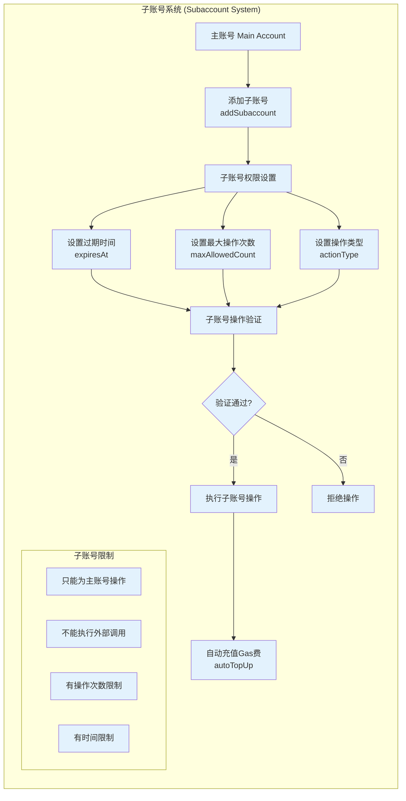

## 1. 子账号系统 (Subaccount System)


### 设计目的
子账号系统允许第三方应用或服务代表用户执行操作，同时保持安全控制。

### 核心特性

**主要组件**：
- **主账号 (Main Account)**: 资金和权限的所有者
- **子账号 (Subaccount)**: 被授权代表主账号操作的地址
- **SubaccountApproval**: 包含授权信息的结构体

**权限控制**：
```solidity
struct SubaccountApproval {
    address subaccount;        // 子账号地址
    bool shouldAdd;           // 是否添加子账号
    uint256 expiresAt;        // 权限过期时间
    uint256 maxAllowedCount;  // 最大操作次数
    bytes32 actionType;       // 操作类型 (如: ORDER_ACTION)
    uint256 nonce;           // 防重放攻击
    uint256 desChainId;      // 目标链ID
    uint256 deadline;        // 签名截止时间
    bytes32 integrationId;   // 集成标识符
    bytes signature;         // 主账号签名
}
```

**安全限制**：
- 子账号只能为主账号执行操作
- 不能执行外部调用 (防止恶意行为)
- 有操作次数和时间限制
- 需要主账号预先授权

**自动充值**：
- 子账号可以自动从主账号余额中充值Gas费
- 通过 `autoTopUpAmount` 设置
