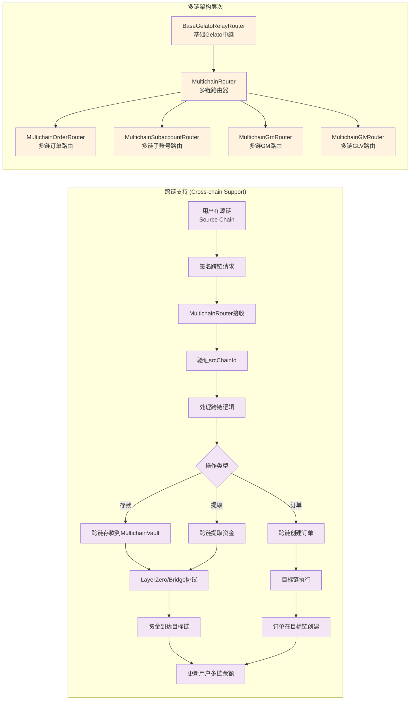

## 1. 子账号系统 (Subaccount System)


### 设计目的
子账号系统允许第三方应用或服务代表用户执行操作，同时保持安全控制。

### 核心特性

**主要组件**：
- **主账号 (Main Account)**: 资金和权限的所有者
- **子账号 (Subaccount)**: 被授权代表主账号操作的地址
- **SubaccountApproval**: 包含授权信息的结构体

**权限控制**：
```solidity
struct SubaccountApproval {
    address subaccount;        // 子账号地址
    bool shouldAdd;           // 是否添加子账号
    uint256 expiresAt;        // 权限过期时间
    uint256 maxAllowedCount;  // 最大操作次数
    bytes32 actionType;       // 操作类型 (如: ORDER_ACTION)
    uint256 nonce;           // 防重放攻击
    uint256 desChainId;      // 目标链ID
    uint256 deadline;        // 签名截止时间
    bytes32 integrationId;   // 集成标识符
    bytes signature;         // 主账号签名
}
```

**安全限制**：
- 子账号只能为主账号执行操作
- 不能执行外部调用 (防止恶意行为)
- 有操作次数和时间限制
- 需要主账号预先授权

**自动充值**：
- 子账号可以自动从主账号余额中充值Gas费
- 通过 `autoTopUpAmount` 设置


## 2. 跨链支持 (Cross-chain Support)



### 设计架构

**withRelay修饰器的跨链逻辑**：
```solidity
modifier withRelay(
    IRelayUtils.RelayParams calldata relayParams,
    address account,
    uint256 srcChainId,  // 关键：源链ID
    bool isSubaccount
) {
    // 1. 验证跨链参数
    if (_isMultichain()) {
        if (!dataStore.getBool(Keys.isSrcChainIdEnabledKey(srcChainId))) {
            revert Errors.InvalidSrcChainId(srcChainId);
        }
    }
    // 2. 执行跨链逻辑
    _;
}
```

### 跨链流程

**1. 同链操作 (srcChainId == block.chainid)**:
- 直接在当前链执行
- 使用标准的Gelato Relay

**2. 跨链操作 (srcChainId != block.chainid)**:
- 用户在源链签名请求
- 通过LayerZero等跨链协议传输
- 在目标链执行操作
- 资金在MultichainVault中管理

### 多链架构层次

**继承关系**：
```
BaseGelatoRelayRouter
    ↓
MultichainRouter (添加跨链支持)
    ↓
具体多链路由器:
- MultichainOrderRouter (订单)
- MultichainSubaccountRouter (子账号)
- MultichainGmRouter (GM代币)
- MultichainGlvRouter (GLV代币)
```

### 资金管理

**MultichainVault**：
- 管理用户在不同链上的余额
- 支持跨链资金转移
- 记录跨链交易历史

**LayerZero集成**：
- 使用LayerZero协议进行跨链通信
- 支持Stargate进行资金桥接
- 处理跨链费用和滑点
 
